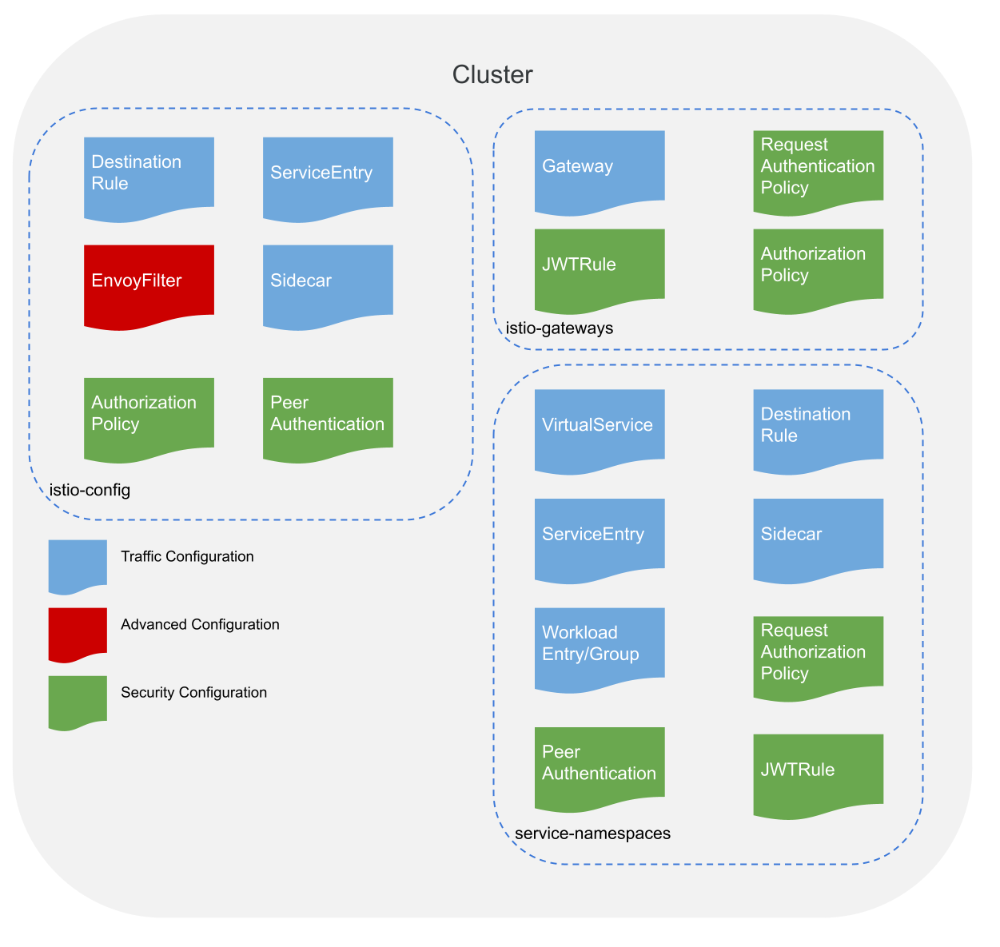

# Istio Configuration Management

Istio has adopted a configuration paradigm that is very user personal driven. It is common for many teams to share Kubernetes clusters, which means that it is desired to set defaults and prevent teams from impacting each other as much as possible. Istio plays its role by allowing cluster admins to dictacte sane defaults for their Mesh but delegate individual workload configuration to the teams that support the applications. Below we will discuss how Istio allows each user persona to manage its configuration.

## Istio rootNamespace (cluster owners)

The istio `rootNamespace` is for admins to define sane defaults for the entire mesh. Wether its setting a default security policy or tuning the Meshes performance, the cluster owner has the responsibility to configure the mesh for the rest of the teams to utilize. 

This namespace is the only recommended namespace for the `EnvoyFilter` resource. Not only is it considered an advanced configuration, it can imact the overall health of the mesh. If users would like to utilize an EnvoyFilter for their workload, it is recommended to label your workload with something that matches the selector of the EnvoyFilter. For example if you have an external authorization EnvoyFilter, make it so any workload with the label `external-auth: enabled` will have it applied. 

NOTE: In the past users may have used it to store all Istio configurations but this would not be considered bad practice. It is not always possible to configure the mesh on a per namespace level without placing the Istio configuration in the namespace it is meant to target.

Cluster owners can

* manage global service discovery properties
* enable default security policies
* add custom filters

## Gateway Namespaces (network owners)

The gateways namespaces control ingress/egress traffic to the cluster. For ingress traffic that means routing traffic to its respective workload. In a large organiziation it is common for a service owner to request from the network owner that their workload be exposed externally to the cluster.

Network owners can

* control cluster ingress traffic
* set security specifications on inbound traffic (https, authentication etc)
* manage ingress and egress certificates and identities
* control cluster egress traffic
* limit external hosts that can be called
* control which workloads are exposed externally
* manage gateway lifecycles

## Service Namespaces (service owners)

The namespaces that contain your workloads are also the same namespaces that should hold workload related Istio configuration. The reason for this is that it isolates the scope of the configuration as well it sitting near the workload that it applies to. This is inline with how users are expected to interact with Istio. For example, a team may be assigned a few namespaces in which they can deploy their applciations. They may not have access to shared namespaces in the cluster to prevent them from impacting other teams. Istios model still allows them to apply mesh configurations to their own applications. If they needed to expose their applications via an Istio ingress gateway, they may need to ask their operations team to create a VirtualService from the istio-gateways namespace to their workload namespace. 

Service owners can

* manage ingress traffic into their applications
* authenticate and authorize requests
* scope service discovery
* manage allowable egress hosts
* manage application lifecycles
