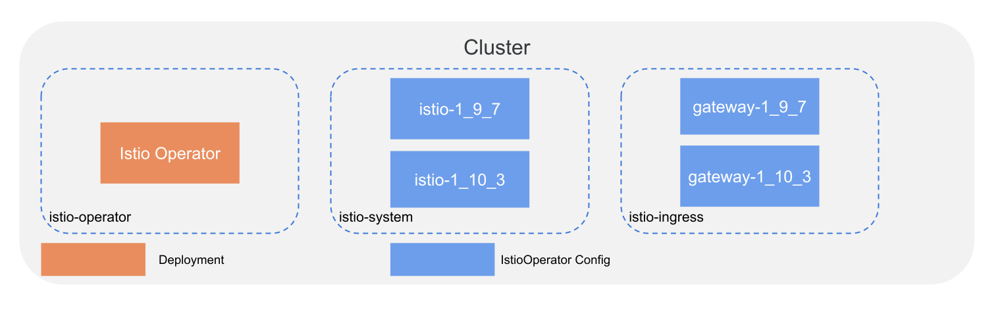

# Istio Production Deployment Via Operator

For recommended namespaces see - [Istio Namespaces](./namespaces.md)

Our recommended approach to deploying the Istio control plane is to use the deploy the operator and use IstioOperator configuration. The reason we recommend the Istio operator is that facilitates the upgrading of the Istio control plane using the Canary deployment architecutre.

## Deploy Istio Operator



First we will be deploying the Istio Operator to the `istio-operator` namespace. It is recommended to do this via helm so that it is easier to upgrade in the future. You may want to fork the existing helm chart to add it to your existing CI process. This will make upgrades slightly easier in the future. 

```sh
# Create namespaces
kubectl create namespace istio-system 
kubectl create namespace istio-gateways 
kubectl create namespace istio-config

# Download the latest istio release

ISTIO_VERSION=1.10.3
REVISION=1-10-3

curl -L https://istio.io/downloadIstio | ISTIO_VERSION=$ISTIO_VERSION sh -

cd istio-$ISTIO_VERSION

# Deploy operator
# cannot use helm install due to namespace ownership https://github.com/istio/istio/pull/30741
TEMPLATE=$(helm template istio-operator-$REVISION manifests/charts/istio-operator \
  --set operatorNamespace=istio-operator \
  --set watchedNamespaces="istio-system\,istio-gateways" \
  --set global.hub="docker.io/istio" \
  --set global.tag="$ISTIO_VERSION" \
  --set revision="$REVISION")

echo $TEMPLATE > operator.yaml

kubectl apply -f operator.yaml
```

## Resources

* [Istio Operator Deployment](https://istio.io/latest/docs/setup/install/operator/)

### Navigate

* [Deploying Istio Control Plane](./istiod_deployment.md)
* [Deploying Istio Gateways](./gateway_deployment.md)
